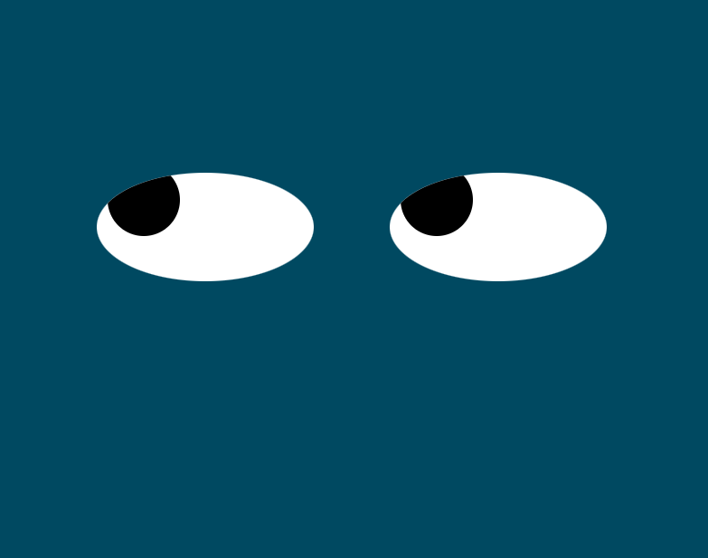

# EYE-MOVEMENT EXERCISE
## Description
This code creates a set of eyes on the page. The pupils of the eyes follow the movement of the mouse.
## Future Features
*Add styling to create a face in addition to the eyes
*Add a button to switch the eyes from following the mouse movement to create and follow the movement of a ball bouncing around the screen.

